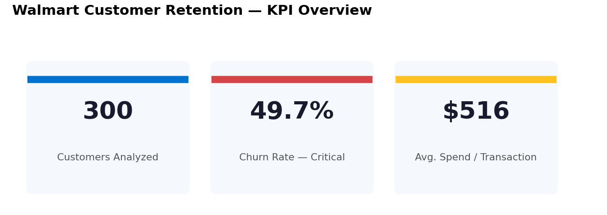
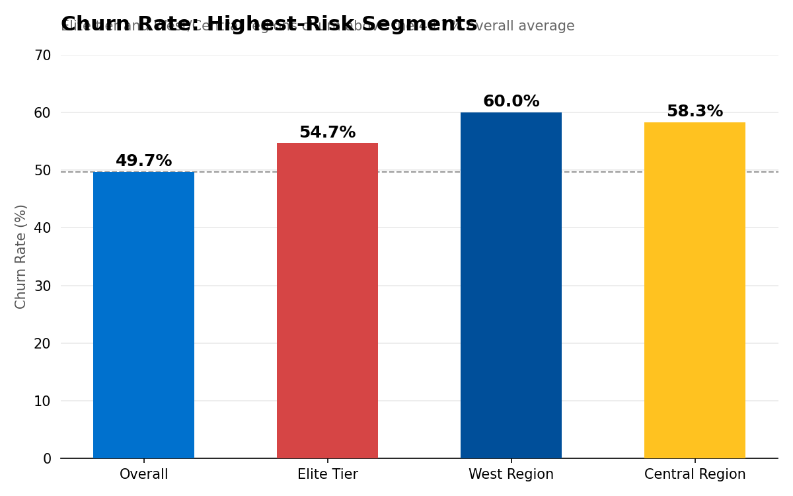
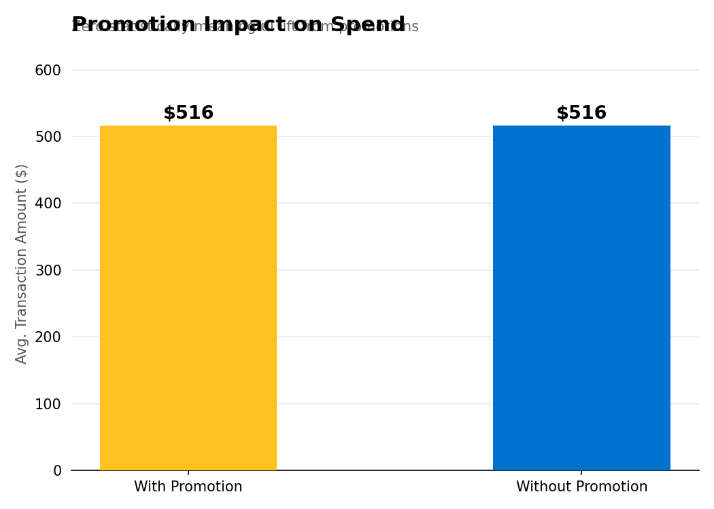

# Walmart Customer Retention Analytics — Power BI Dashboard

A production-style Power BI dashboard analyzing customer churn, loyalty, and promotion effectiveness across 300 customers, 1,000 transactions, and 50 stores, built on a star-schema data model with DAX-driven KPIs.

**Tools:** Power BI (DAX, Power Query, Star Schema) &nbsp;|&nbsp; **Domain:** Retail Analytics, Customer Retention

---

## 1. Business Problem

Walmart's retention team needed clarity on three questions: why customers churn, who the loyal vs. at-risk segments are, and whether the loyalty/promotions program is actually retaining customers. This project builds a 4-page executive Power BI report to answer all three with a proper dimensional data model rather than flat spreadsheet analysis.

## 2. Data Model — Star Schema

```
                     ┌────────────────────┐
                     │  fact_Transactions  │  1,000 rows
                     │  (Amount, Category, │
                     │   Promotion_Applied)│
                     └─────────┬──────────┘
          ┌───────────┬────────┼────────┬───────────┐
   ┌──────▼─────┐┌────▼─────┐┌─▼──────┐┌─▼──────────┐
   │dim_Demo-   ││dim_Store ││dim_    ││dim_Churn   │
   │graphics    ││(50 rows) ││Loyalty ││(300 rows)  │
   │(300 rows)  ││          ││(300)   ││            │
   └────────────┘└──────────┘└────────┘└────────────┘
```

| Table | Rows | Key Fields |
|---|---|---|
| dim_Demographics | 300 | Customer_ID, Age, Gender, Region, Income_Level, Membership_Since, Preferred_Channel |
| fact_Transactions | 1,000 | Transaction_ID, Customer_ID, Store_ID, Product_Category, Amount, Promotion_Applied |
| dim_Store | 50 | Store_ID, Store_Type, Region, Opening_Year |
| dim_Loyalty | 300 | Customer_ID, Loyalty_Tier, Points_Earned, Points_Redeemed |
| dim_Churn | 300 | Customer_ID, Last_Purchase_Date, Churn_Flag, Churn_Reason |

Naming follows `dim_` / `fact_` conventions (star schema best practice) for a self-documenting data model.

## 3. Repository Structure

```
walmart-customer-retention-powerbi/
├── README.md
├── data/
│   └── README.md                  # table schema (source files not included)
├── powerbi/
│   └── Walmart_Retention_Dashboard.pbix
├── dax/
│   └── measures.md                # key DAX measures used in the report
├── docs/
│   └── Senior_Analyst_Playbook.docx  # full build guide: theme, Power Query M code, DAX
└── assets/
    └── screenshots/                # report page exports (KPI Overview, Loyalty, etc.)
```

## 4. ETL — Power Query Highlights

- Explicit type-casting on every table (dates, text, numeric)
- Derived columns: `Age_Group`, `Amount_Band`, `Days_Since_Last_Purchase`, `Churn_Status`, `Points_Unredeemed`, `Redemption_Rate`
- Null handling: blank `Gender` → "Not Specified"; blank `Churn_Reason` → "Active"
- Deduplication on `Customer_ID` across dimension tables

See `docs/Senior_Analyst_Playbook.docx` for the full M code.

## 5. Report Pages

1. **KPI Overview** — headline churn, spend, and customer count cards
2. **Loyalty & Promotions** — points earned vs. redeemed, promotion lift analysis, tier-level churn
3. **Store Insights** — store/region performance and retention correlation
4. **Customer Segmentation** — CLV and RFM-style scoring, dynamic slicers on Region, Channel, Income, Tier

## 6. Key Findings

| Metric | Result |
|---|---|
| Overall churn rate | **49.7%** — nearly 1 in 2 customers has churned |
| Highest-risk regions | **West (60%)** and **Central (58.3%)** |
| Highest-risk loyalty tier | **Elite — 54.7% churn** (counterintuitive: premium customers are the most vulnerable) |
| Promotion impact on spend | **Zero statistically meaningful difference** — $516 avg. spend with promotion vs. $516 without |

## 7. Visuals

<p align="center">
  
</p>
<p align="center">
  
  
</p>

> These are chart reconstructions of the report's headline metrics for quick preview. Drop actual Power BI page exports into `assets/screenshots/` once you have the `.pbix` open — see `powerbi/README.md`.

## 8. Business Recommendations

1. **Redesign the promotions strategy** — current promotions show no measurable lift in spend, meaning the program is a cost center rather than a retention driver.
2. **Investigate Elite-tier churn specifically** — losing premium customers at a higher rate than standard tiers is a high-value problem; a targeted Elite retention flow is likely more impactful than broad discounting.
3. **Prioritize West and Central regions** for retention campaigns given their outsized churn contribution.

## 9. How to Use This Repo

1. Open `powerbi/Walmart_Retention_Dashboard.pbix` in Power BI Desktop.
2. Refresh data connections if pointing to your own copy of the 5 source tables (schema in `data/README.md`).
3. `dax/measures.md` lists the core measures if you want to rebuild the model from scratch.
4. `docs/Senior_Analyst_Playbook.docx` is the full step-by-step build guide, including the Walmart brand theme JSON.

---
**Author:** Guhan K S · [LinkedIn](https://linkedin.com/in/guhan-ks) · [GitHub](https://github.com/Guhanks)
